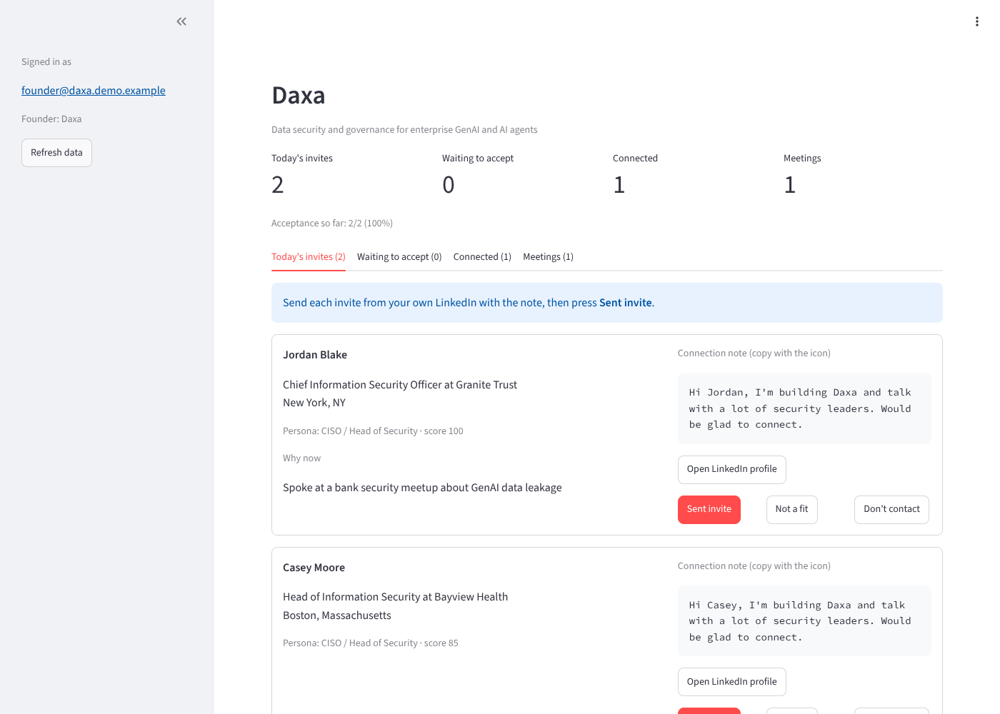
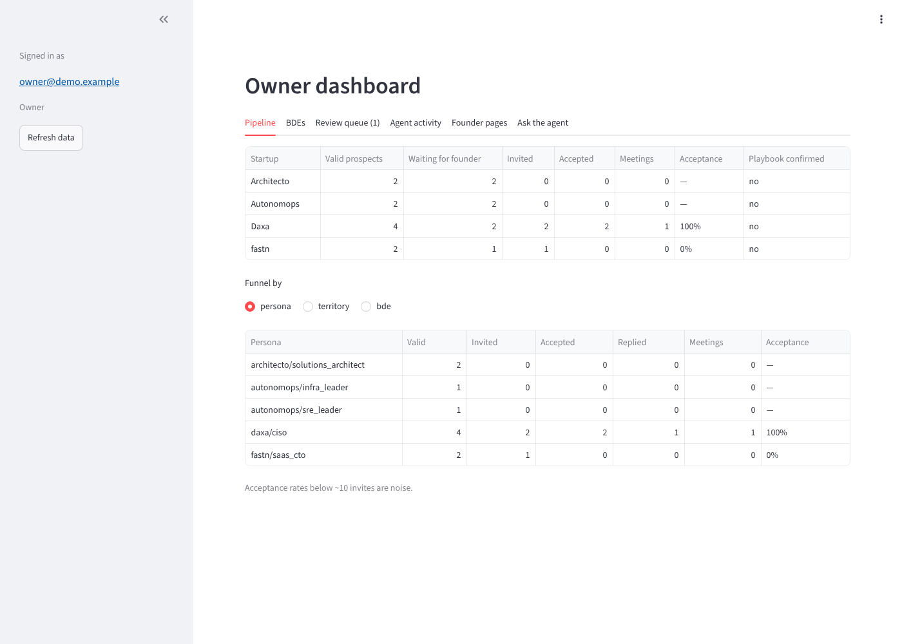

# BDE prospecting agent

An AI agent that manages four BDEs in India doing manual LinkedIn research, checks their work, and gives each startup founder a daily list of the right US prospects with a personal note, without automating LinkedIn.

**Goal:** more qualified first conversations per founder per week, which is what moves a seed startup from $0–500K toward $1–4M ARR.

## How the agent works

Claude runs in a loop with a set of tools. Each run, it looks at the situation, decides, acts through tools, reads the results (including refusals), adapts, and stops when the job is done. A completion check sends it back once if something is unfinished. It keeps a journal so the next run knows what it was watching.

```
                ┌──────────────────────── agent loop (Claude) ────────────────────────┐
  trigger ───►  │ observe ─► decide ─► act through tools ─► read result / refusal ─┐  │
 (schedule      │    ▲                                                            │  │
  or owner)     │    └────────────────────────────────────────────────────────────┘  │
                │ completion check ─► journal for next run ─► summary to owner        │
                └─────────────────────────────────────────────────────────────────────┘
                     │ tools enforce the rules (code, not prompt)
          ┌──────────┼──────────────┬──────────────────┬─────────────────┐
          ▼          ▼              ▼                  ▼                 ▼
     BDE tasks   sheet checks   note-writer        founder invite     owner review
     + coaching  (agent columns specialist         lists              (escalations)
                  only)         (handoff)
```

| Run | When (IST) | What the agent does |
| --- | --- | --- |
| `morning` | 09:30 | Reviews each BDE's history and options, assigns today's focus with a reason and a coaching note |
| `evening` | 20:00 | Checks the day's rows (rules first, its own judgement on unclear titles, escalates when unsure), picks each founder's invites, gets notes from the note-writer, queues them |
| `weekly` | Monday | Analyses performance by persona, territory and BDE; sends a report with proposed changes for you to approve |
| `ask` | any time | Answers your question from the data, read-only |

More detail: [docs/design.md](docs/design.md). Guide for BDEs: [docs/bde-guide.md](docs/bde-guide.md).

## Tools and boundaries

The agent can only act through these tools, and each mode gets only the tools it needs.

| Tool | Modes | Rule enforced in code |
| --- | --- | --- |
| `get_situation`, `get_bde_history`, `get_performance` | all | Read-only |
| `get_assignment_options` | morning, ask | Ranked options with the numbers behind them; a suggestion, not an order |
| `assign_task` | morning | Only the BDE's startups, real personas, active territories; one task per BDE per day; no two BDEs on the same focus; target 5–120% of normal |
| `get_rows_to_check`, `apply_rule_results`, `record_check_decisions` | evening | Rule-rejected rows can never be marked valid; non-valid decisions need a reason; only agent columns are written |
| `get_founder_candidates`, `draft_invite_note`, `queue_founder_invites` | evening | Only eligible rows, re-checked against do-not-contact; daily limit; every note must pass guardrails |
| `escalate_to_human` | morning, evening, weekly | Marks rows for review; delivered to you at the end of the run |
| `send_weekly_report` | weekly | Proposes changes; can't apply them |
| `write_journal` | morning, evening, weekly | Memory for the next run |

The agent can't touch LinkedIn, contact prospects, or change playbooks, the roster or the rules. Text from the sheet is treated as data; the demo sheet includes a prompt-injection attempt to test this.

## Try it

```sh
cd projects/AgentGTM/workflows/bde-prospecting
pip install -e '.[dev,mcp,app]'
pytest                                        # 53 tests, incl. the agent loop and the web app
python tests/evals/eval_persona.py            # title-matching eval (free)

export ANTHROPIC_API_KEY=...
cp -r examples/demo-sheet /tmp/demo-sheet
python -m bde_prospecting agent evening --store csv:/tmp/demo-sheet --date 2026-10-12
python tests/evals/eval_agent.py              # live agent eval on a copy of the demo sheet
```

Without an API key, `python -m bde_prospecting demo --no-llm` runs the fixed-rule fallback.

## Web app (Google sign-in)

Founders and you sign in with Google. Access is by email: yours in `config/bdes.toml` `[owner] emails`, each founder's in their playbook's `founder_emails`.

| Founder page | Owner dashboard |
| --- | --- |
|  |  |

- **Founders** see only their startup: today's invites with the note (copy button), the LinkedIn link, and buttons to record *Sent invite → Accepted → Replied → Meeting booked*, *Not a fit* or *Don't contact*. Those clicks are what the agent learns from.
- **You** see the pipeline per startup and persona/territory/BDE, BDE quality, the review queue (approve or reject), the agent's run summaries, journal and proposed changes, every founder page, and an *Ask the agent* box.
- Every action is re-checked on the server against the signed-in email (`src/bde_prospecting/access.py`).

Try it locally without any Google setup: `pip install -e '.[app]' && python app/demo.py owner` (or `daxa`, `stranger`).
Set up Google sign-in and deploy to Cloud Run: [docs/deploy-web-app.md](docs/deploy-web-app.md).

## Use it from Claude Desktop or Cowork (MCP)

The same tools, with the same rules, are available as an MCP server:

```json
{
  "mcpServers": {
    "agentgtm-prospecting": {
      "command": "python",
      "args": ["-m", "bde_prospecting.mcp_server"],
      "env": {
        "AGENTGTM_STORE": "sheets:<spreadsheet-id>",
        "GOOGLE_SERVICE_ACCOUNT_FILE": "/path/to/key.json",
        "AGENTGTM_MCP_MODE": "ask"
      }
    }
  }
}
```

`AGENTGTM_MCP_MODE` is `ask` (read-only) by default; set it to `evening` to resolve review rows and queue invites conversationally. Messages are only delivered with `AGENTGTM_SEND=1`.

## Set up for real

1. **Google Sheet.** Create an empty sheet, create a Google Cloud service account, share the sheet with its email as editor, then:
   ```sh
   export GOOGLE_SERVICE_ACCOUNT_FILE=/path/to/key.json
   python -m bde_prospecting setup --store sheets:<spreadsheet-id>
   ```
2. **Playbooks.** Review `../../playbooks/*.toml` with each founder (personas, territories, `exclude_companies`, founder name and channel). Set `confirmed = true`.
3. **Roster.** Fill in names and channels in `config/bdes.toml`.
4. **Claude.** Set `ANTHROPIC_API_KEY`. Without it, `run` falls back to fixed rules.
5. **Phoenix.** `pip install arize-phoenix && phoenix serve`, then set `PHOENIX_COLLECTOR_ENDPOINT=http://localhost:6006`. Every agent turn and tool call is traced.
6. **Dry run for a week.** Run without `--send` and read `outbox/<date>/`, including `agent-*-transcript.json`.
7. **Schedule.** `.github/workflows/agentgtm-bde-prospecting.yml` runs `run morning|evening|weekly`. Add the secrets listed there, set `AGENTGTM_BDE_ENABLED=true`, and later `AGENTGTM_SEND=true`.

## Commands

```sh
python -m bde_prospecting <command> [mode] --store <csv:dir | sheets:id> [--date YYYY-MM-DD] [--send]
```

| Command | What it does |
| --- | --- |
| `agent morning\|evening\|weekly` | Run the agent |
| `agent ask --question "..."` | Ask the agent about the data |
| `run morning\|evening\|weekly` | Agent if Claude is configured, otherwise the fixed-rule steps |
| `plan`, `check`, `founder-batch`, `weekly-report` | Fixed-rule steps (fallback) |
| `setup` | Create sheet tabs, headers, dropdowns |
| `demo` | Fixed-rule day on the demo sheet in a temp folder |

## Environment variables

| Variable | Needed for | Purpose |
| --- | --- | --- |
| `GOOGLE_SERVICE_ACCOUNT_FILE` | `sheets:` store | Google service account key |
| `ANTHROPIC_API_KEY` | the agent | Claude |
| `AGENTGTM_AGENT_MODEL`, `AGENTGTM_AGENT_EFFORT`, `AGENTGTM_MAX_ITERATIONS` | optional | Agent model (default `claude-opus-5-5`), effort (default `medium`), loop cap (default 40) |
| `AGENTGTM_MODEL` | optional | Model for the note-writer specialist |
| `PHOENIX_COLLECTOR_ENDPOINT` | optional | Arize Phoenix tracing |
| `AGENTGTM_STORE`, `AGENTGTM_MCP_MODE`, `AGENTGTM_SEND` | MCP server | See above |
| `SMTP_HOST`, `SMTP_PORT`, `SMTP_USER`, `SMTP_PASSWORD`, `SMTP_FROM` | `email` channel | Outgoing mail |
| *(name you choose)* | `slack` channel | Slack incoming-webhook URL; put the variable's name in `contact` |
